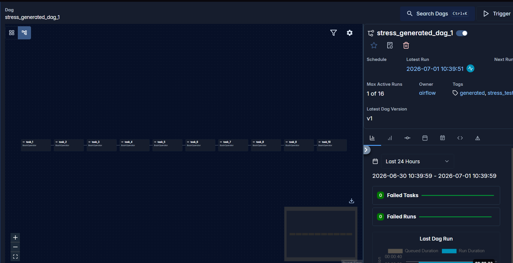

# Stress DAG Factory

## Описание

`stress_dag_factory.py` — фабрика DAG'ов для стресс-теста Airflow.

Параметры: количество DAG'ов, количество задач в DAG, тип зависимости между задачами, schedule, catchup, retries.

Файл создаёт несколько DAG'ов в цикле.  
В каждом DAG создаётся несколько задач `BashOperator`.

## Основные параметры

```python
DAGS_COUNT = 10
TASKS_PER_DAG = 10
DEPENDENCY_TYPE = "linear"
SCHEDULE = None
CATCHUP = False
RETRIES = 0
TASK_SLEEP_SECONDS = 5
```
## Тест

```
docker compose exec airflow-scheduler airflow dags list | findstr stress_generated
docker compose exec airflow-scheduler airflow dags trigger stress_generated_dag_1
```





